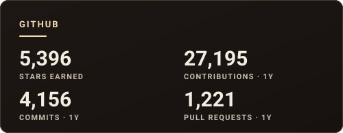

  

  
  
  
  
  

---

### Hi! 👋

I am building **OpenMed**. My mission is to leverage Europe's leading AI to build the default engine for every hospital, pharma giant, and public health agency that requires a secure and powerful medical intelligence platform. I specialize in turning cutting-edge scientific research into robust, compliant, and commercially successful enterprise solutions.

- ⚕️ **Now** — Founder of [OpenMed](https://openmed.life/), open and sovereign medical AI
- 🔬 **Also** — AI Platform Leader at ISC-PIF (CNRS), Paris · 14+ years in public research
- 🤗 **Publishing** — open models and datasets on [Hugging Face](https://huggingface.co/MaziyarPanahi)
- 💬 **Ask me about** medical NLP, open-weight models, HPC, and shipping AI into regulated environments

<!-- HF-STATS:START -->
<!-- Generated by scripts/render_readme.py - edit that, not this. -->

| 🤗 Hugging Face | |
| --- | --- |
| **Models published** | 5,087 |
| **Datasets published** | 78 |
| **Downloads, all time** | **794M** |
| **Downloads, last 30 days** | 47.6M |
| **Followers** | 5,513 |
| **Likes received** | 1,552 |

Combined across [MaziyarPanahi](https://huggingface.co/MaziyarPanahi) and [OpenMed](https://huggingface.co/OpenMed), all authored by me.

**Most downloaded, all time**

| Model | Downloads | Likes |
| --- | ---: | ---: |
| [MaziyarPanahi/Mistral-7B-Instruct-v0.3-GGUF](https://huggingface.co/MaziyarPanahi/Mistral-7B-Instruct-v0.3-GGUF) | 14.1M | 147 |
| [MaziyarPanahi/Meta-Llama-3-8B-Instruct-GGUF](https://huggingface.co/MaziyarPanahi/Meta-Llama-3-8B-Instruct-GGUF) | 12.7M | 103 |
| [MaziyarPanahi/Llama-3-8B-Instruct-32k-v0.1-GGUF](https://huggingface.co/MaziyarPanahi/Llama-3-8B-Instruct-32k-v0.1-GGUF) | 12.4M | 59 |
| [MaziyarPanahi/Phi-3.5-mini-instruct-GGUF](https://huggingface.co/MaziyarPanahi/Phi-3.5-mini-instruct-GGUF) | 12.1M | 33 |
| [MaziyarPanahi/gemma-2-2b-it-GGUF](https://huggingface.co/MaziyarPanahi/gemma-2-2b-it-GGUF) | 12.1M | 14 |
| [MaziyarPanahi/WizardLM-2-7B-GGUF](https://huggingface.co/MaziyarPanahi/WizardLM-2-7B-GGUF) | 12M | 83 |

Live from the <a href="https://huggingface.co/MaziyarPanahi">Hugging Face Hub API</a> · refreshed 19 August 2026
<!-- HF-STATS:END -->

---

### 🏆 GitHub

  
  

  

  <picture>
    <source media="(prefers-color-scheme: dark)" srcset="https://raw.githubusercontent.com/maziyarpanahi/maziyarpanahi/output/github-snake-dark.svg">
    <source media="(prefers-color-scheme: light)" srcset="https://raw.githubusercontent.com/maziyarpanahi/maziyarpanahi/output/github-snake.svg">
    
  </picture>

